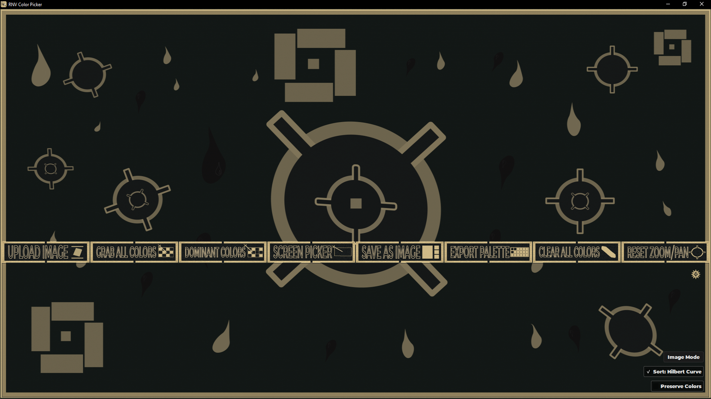
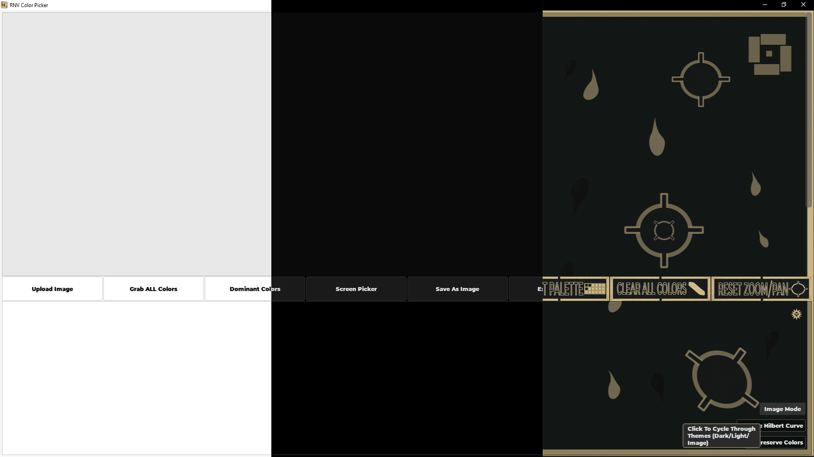
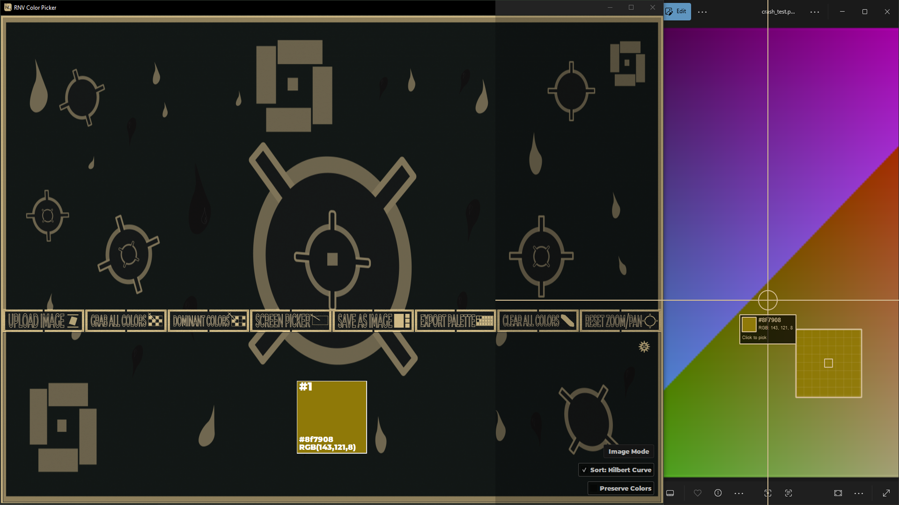
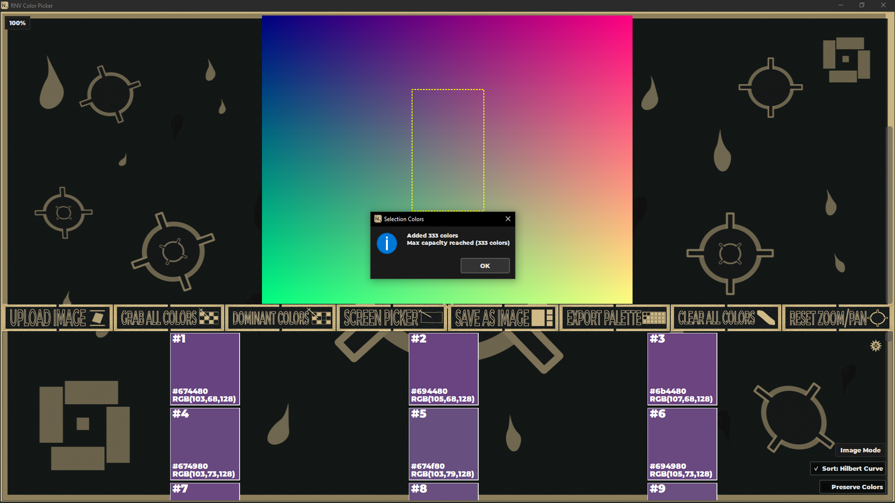
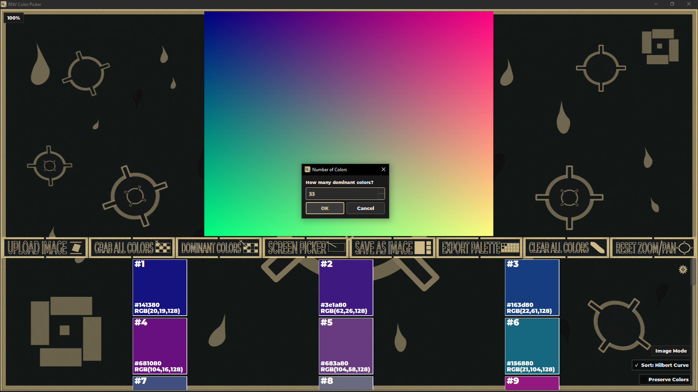
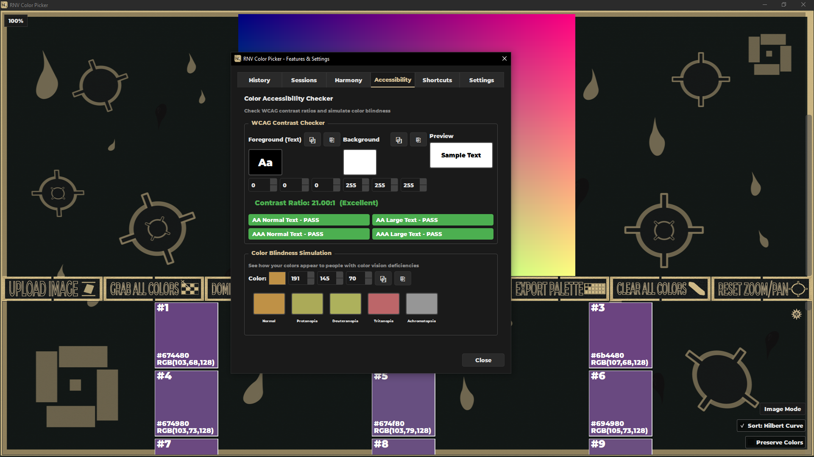
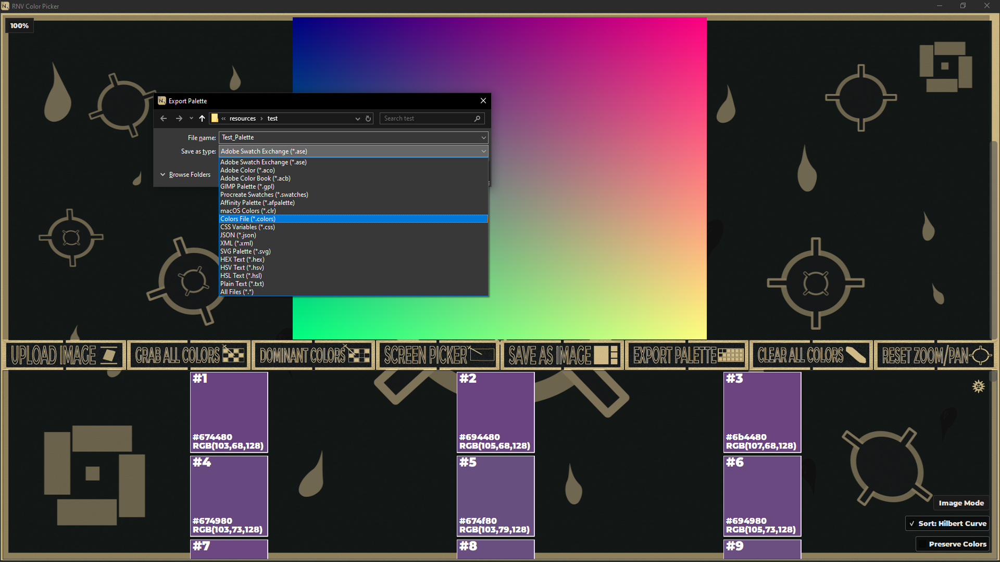

# RNV Color Picker

> Professional color extraction and palette management for designers and developers.

<p align="center">
  
</p>


[](https://github.com/RNVizion/rnv-color-picker/actions/workflows/tests.yml)
[](https://github.com/RNVizion/rnv-color-picker/actions/workflows/tests.yml)

A polished PyQt6 desktop application for extracting, organizing, and exporting colors from any source — uploaded images, the screen under your cursor, or hand-picked regions. Built around a strict modular architecture (core / ui / utils), a centralized theming system with three modes, and an aggressive caching layer that keeps the UI responsive at 333 colors.

---

## Highlights

- **Three color-acquisition workflows** — drag-and-drop image extraction, k-means dominant-color clustering, and a fullscreen screen picker with magnified pixel preview.
- **15+ palette export formats** — Adobe `.ase` and `.aco`, GIMP `.gpl`, Affinity, Procreate `.swatches`, Apple `.clr`, plus JSON, XML, CSS, SVG, and more.
- **Three theme modes** — Dark, Light, and Image (custom backgrounds with translucent overlays).
- **Performance-engineered** — paint events cut from 500ms → 65ms, color refresh from 1.7s → 65ms via widget recycling, LRU pixmap cache, and stylesheet/QColor caches.
- **86% branch coverage** across 1,641 tests (unittest + pytest with hypothesis property-based testing and real Qt threading verification).

## Screenshots

<p align="center">
  <br>
  <em>Three theme modes — Dark, Light, and Image (with translucent overlays on a custom background)</em>
</p>

<table>
  <tr>
    <td align="center">
      <br>
      <em>Screen picker with 8× magnifier overlay</em>
    </td>
    <td align="center">
      <br>
      <em>Drag-to-select region color extraction</em>
    </td>
  </tr>
  <tr>
    <td align="center">
      <br>
      <em>K-means dominant-color clustering</em>
    </td>
    <td align="center">
      <br>
      <em>Settings panel — six tabs covering history, sessions, harmony, accessibility</em>
    </td>
  </tr>
  <tr>
    <td align="center" colspan="2">
      <br>
      <em>Multi-format palette export — 15+ formats including ASE, ACO, GPL, JSON, CSS</em>
    </td>
  </tr>
</table>

## Features

**Color extraction**
- Upload images and sample colors via click, double-click, or drag-to-select region
- Screen color picker with magnified pixel-level preview, works anywhere on screen
- Dominant color extraction via configurable k-means clustering
- Color history with timestamps, persistent across sessions

**Palette management**
- Lock individual colors to preserve them across clear/regenerate cycles
- Hilbert-curve perceptual sorting (alongside HSL sort)
- Up to 333 colors per palette with weight metadata
- Per-color context menu: copy as HEX / RGB / HSV / HSL, remove, lock

**Export formats**
- Adobe Swatch Exchange (`.ase`), Photoshop (`.aco`), Adobe Color Book (`.acb`)
- GIMP (`.gpl`), Affinity (`.afpalette`), Procreate (`.swatches`), Apple (`.clr`)
- JSON, XML, CSS variables, SCSS, SVG swatch sheet
- Plain text (`.txt`, `.colors`, `.hex`, `.hsl`, `.hsv`)

**Color science**
- WCAG AA/AAA contrast ratio checker with foreground/background swap
- Color blindness simulation (protanopia, deuteranopia, tritanopia, achromatopsia, achromatomaly)
- Color harmony generator (complementary, triadic, tetradic, analogous, split-complementary, monochromatic, compound)

**Sessions and persistence**
- Save and load named workspace sessions (`.cpksession`)
- Auto-save every 6 minutes with crash recovery on next launch
- Recent sessions list, deletable per-entry

**Themes**
- Dark mode (default), Light mode, Image mode (custom backgrounds + translucent overlays)
- Brand-gold accent system, single source of truth in `utils/config.py`

## Tech Stack

| Layer | Technology |
|---|---|
| Language | Python 3.13 |
| GUI | PyQt6 6.10 |
| Image processing | Pillow, NumPy |
| ML | scikit-learn (`KMeans` for dominant color extraction) |
| Testing | pytest, pytest-qt, hypothesis, unittest |
| Coverage | coverage.py (with branch coverage) |

## Installation

**Requirements:** Python 3.13+ on Windows, macOS, or Linux.

```bash
# Clone the repo
git clone https://github.com/RNVizion/rnv-color-picker.git
cd RNV_Color_Picker

# Install dependencies
pip install -r requirements.txt

# Run
python RNV_Color_Picker.py
```

## Quick Start

1. **Launch** — `python RNV_Color_Picker.py`. The app starts in Dark mode by default; if a `resources/background_images/background.png` is present, Image mode activates automatically.
2. **Load an image** — `Ctrl+O` or drag-and-drop. Double-click any pixel to add its color, or shift-drag to extract every unique color in a region.
3. **Pick from anywhere on screen** — `Ctrl+Shift+C` opens a fullscreen overlay with an 8× magnifier. Click to capture, `Esc` to cancel.
4. **Export** — `Ctrl+E` opens the export dialog. Choose any of 15+ formats; the file extension determines dispatch.

Full keyboard shortcut reference: `Ctrl+/` opens the in-app About dialog with a complete listing.

## Project Structure

```
RNV_Color_Picker/
├── RNV_Color_Picker.py          # Application entry point and main window
├── core/                         # Pure logic — no UI dependencies
│   ├── color_math.py             # RGB/HSV/HSL/Lab/RYB conversions, blending algorithms
│   ├── color_collection.py       # Palette container with weight metadata
│   ├── color_harmony.py          # Harmony generators
│   ├── color_history.py          # Persistent timestamped color history
│   ├── accessibility.py          # WCAG contrast, color-blindness simulation
│   ├── palette_formats.py        # Import/export for 17 file formats
│   ├── screen_color_picker.py    # Fullscreen magnifier overlay
│   ├── hilbert_curve.py          # Perceptual color sorting
│   └── workers.py                # QThread workers for non-blocking ops
├── ui/                           # PyQt6 widgets and dialogs
│   ├── settings_panel.py         # Six-tab settings dialog
│   ├── about_dialog.py
│   ├── color_swatch_widget.py
│   ├── image_viewer.py           # QGraphicsView with zoom/pan/select
│   ├── image_button.py           # Image-mode-aware button
│   ├── progress_dialog.py
│   ├── transparent_scroll_widget.py
│   └── widget_pool.py            # Widget recycling for fast palette refresh
├── utils/                        # Cross-cutting utilities
│   ├── config.py                 # Single source of truth for colors, paths, constants
│   ├── logger.py                 # Color-coded structured logging
│   ├── error_handler.py          # Centralized exception handling
│   ├── signal_manager.py         # Tracked Qt signal connections (leak-free cleanup)
│   ├── settings_manager.py       # JSON-backed user preferences
│   ├── session_manager.py        # Workspace save/load with auto-save
│   ├── cache.py                  # ColorCache, QColorCache, StylesheetCache, FontCache
│   ├── pixmap_cache.py           # LRU pixmap cache for image zoom
│   ├── async_file_ops.py         # QThread-based file I/O
│   ├── clipboard.py              # Cross-platform clipboard helpers
│   ├── dialog_helper.py          # Themed message boxes
│   ├── file_utils.py             # Safe file operations
│   └── font_loader.py            # Custom font loading with fallbacks
├── resources/
│   ├── icons/                    # Application icon
│   ├── fonts/                    # Embedded Montserrat-Black
│   ├── button_images/            # Image-mode button graphics
│   └── background_images/        # Image-mode backgrounds
├── tests/                        # 1,241 pytest tests (test_*.py)
└── test_rnv_color_picker.py      # 400 unittest tests (legacy harness)
```

## Testing

The project carries 1,641 tests across two harnesses:

| Harness | Tests | Notes |
|---|---|---|
| `unittest` | 400 | Legacy regression suite |
| `pytest` | 1,241 | Modern suite — hypothesis property tests, pytest-qt for real Qt threading |
| **Total** | **1,641** | **86% TOTAL coverage** with branch coverage enabled |

**Run the full suite:**

```bash
python run_tests.py
```

This runs both harnesses sequentially and produces a combined coverage report.

**Coverage highlights** — modules above 90%:

| Module | Coverage |
|---|---|
| `utils/error_handler.py` | 100% |
| `utils/pixmap_cache.py` | 99% |
| `ui/progress_dialog.py` | 97% |
| `ui/about_dialog.py` | 96% |
| `core/accessibility.py` | 96% |
| `core/color_math.py` | 95% |
| `core/palette_formats.py` | 94% |
| `utils/async_file_ops.py` | 94% |
| `utils/session_manager.py` | 93% |
| `core/color_history.py` | 91% |
| `core/color_harmony.py` | 91% |
| `utils/signal_manager.py` | 91% |

A detailed write-up of the test architecture, banked patterns, and bug-discovery history is in [TESTING.md](TESTING.md).

## Architecture Highlights

**Centralized config (`utils/config.py`)** — every color in the app comes from one file. Theme dicts (`DARK_THEME_COLORS`, `LIGHT_THEME_COLORS`, `IMAGE_MODE_COLORS`) are referenced by key throughout the codebase; brand colors (`BRAND_GOLD`, `BRAND_GOLD_DARK`) are typed as `Final[str]`. Any hardcoded color elsewhere is a bug.

**Signal lifecycle management (`utils/signal_manager.py`)** — every Qt signal connection is registered with a `SignalConnectionManager`, tagged with a `track_as` label, and disconnected on widget close. Eliminates the leak-then-crash class of PyQt bugs.

**Multi-tier caching (`utils/cache.py`, `utils/pixmap_cache.py`)** — LRU caches for `QColor` instantiation, RGB↔HSL conversion, stylesheet strings, fonts, and zoomed pixmaps. Hit-rate metrics exposed via `get_stats()`. Backing the 500ms → 65ms paint event speedup.

**Widget recycling (`ui/widget_pool.py`)** — color swatch widgets are pooled and re-configured rather than destroyed/recreated on palette refresh. Backing the 1.7s → 65ms refresh speedup at 333 colors.

**Async file I/O (`utils/async_file_ops.py`, `core/workers.py`)** — large image loads, palette exports, and JSON saves run on `QThread` workers with progress signals. UI never blocks, even on 4K images or 333-color palette exports.

## Keyboard Shortcuts

| Key | Action |
|---|---|
| `Ctrl+O` | Open / upload image |
| `Ctrl+S` | Save color swatch |
| `Ctrl+E` | Export palette |
| `Ctrl+G` | Grab all colors from image |
| `Ctrl+K` | Extract dominant colors (k-means) |
| `Ctrl+Shift+C` | Screen color picker |
| `Ctrl+D` | Clear all colors (locks preserved) |
| `Ctrl+,` | Open settings & features panel |
| `Ctrl+/` | Open About dialog |
| `F11` | Toggle tooltips |
| `F12` | Toggle debug overlay |
| `Mouse wheel` | Zoom image |
| `Click + drag` | Pan image |
| `Double-click` | Pick color from pixel |
| `Shift + drag` | Select region for extraction |

## Roadmap

- [ ] Web-deployable Wasm build (Pyodide / PyQt-WebAssembly)
- [ ] Plugin system for custom export formats
- [ ] Cloud session sync (optional, opt-in)
- [ ] Mutation testing (mutmut) on `core/` modules

## Related Projects

Part of the RNVizion suite of color tools:

- **[RNV Color Mixer](https://github.com/RNVizion/rnv-color-mixer)** — Bringing real-world paint mixing to the digital palette.
- **[RNV Color Palette Manager](https://github.com/RNVizion/rnv-color-palette-manager)** — Professional desktop application for creating, managing, and exporting color palettes.

## License

[MIT](LICENSE) — free to use, modify, and distribute.

## Author

Built by [RNVizion](https://github.com/RNVizion)

---

<p align="center">
  Built with PyQt6 · 1,641 tests · 86% coverage
</p>
